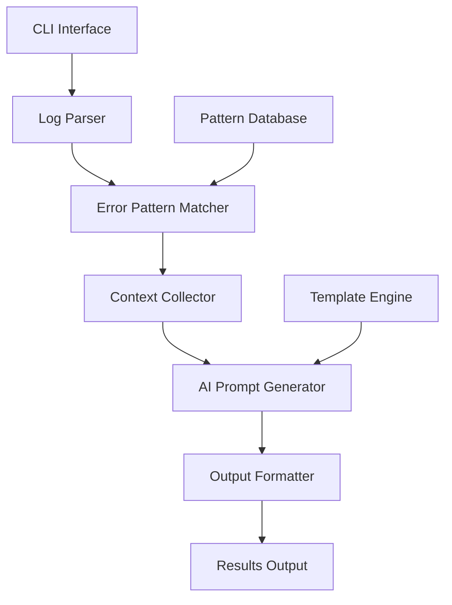

# Design Document

## Overview

The GitHub Actions AI Analyzer MVP is a Python-based command-line tool that processes GitHub Actions workflow logs to extract structured error information and generate AI-optimized prompts. The system follows a modular architecture with clear separation between log parsing, error pattern matching, and output generation.

## Architecture

The system uses a pipeline architecture with the following main components:



### Core Components

1. **CLI Interface**: Entry point handling command-line arguments and user interaction
2. **Log Parser**: Processes raw GitHub Actions logs, removes noise, extracts structured data
3. **Error Pattern Matcher**: Identifies known error patterns using regex and rule-based matching
4. **Context Collector**: Gathers additional context from workflow files and repository metadata
5. **AI Prompt Generator**: Creates optimized prompts for AI services based on detected errors
6. **Output Formatter**: Formats results in requested output format (JSON, text)

## Components and Interfaces

### CLI Interface (`cli/main.py`)

**Responsibilities:**
- Parse command-line arguments
- Validate input files and parameters
- Orchestrate the analysis pipeline
- Handle errors and display results

**Interface:**
```python
def main(log_file: str, output_format: str = "text", output_file: Optional[str] = None) -> int
```

### Log Parser (`core/log_parser.py`)

**Responsibilities:**
- Read and parse GitHub Actions log files
- Remove timestamps, metadata noise, and irrelevant sections
- Extract structured log entries with context

**Interface:**
```python
class LogParser:
    def parse(self, log_content: str) -> ParsedLog
    def extract_error_sections(self, parsed_log: ParsedLog) -> List[LogSection]
```

### Error Pattern Matcher (`core/pattern_matcher.py`)

**Responsibilities:**
- Match log sections against known error patterns
- Classify errors by type and severity
- Extract relevant error details and context

**Interface:**
```python
class PatternMatcher:
    def match_patterns(self, log_sections: List[LogSection]) -> List[DetectedError]
    def get_python_patterns(self) -> List[ErrorPattern]
```

### Context Collector (`core/context_collector.py`)

**Responsibilities:**
- Gather workflow configuration details
- Extract repository metadata when available
- Collect environment and setup information

**Interface:**
```python
class ContextCollector:
    def collect_context(self, detected_errors: List[DetectedError]) -> AnalysisContext
```

### AI Prompt Generator (`core/prompt_generator.py`)

**Responsibilities:**
- Generate structured AI prompts based on analysis results
- Prioritize errors and format for optimal AI response
- Include relevant context and specific questions

**Interface:**
```python
class PromptGenerator:
    def generate_prompt(self, context: AnalysisContext) -> AIPrompt
    def format_for_ai_service(self, prompt: AIPrompt) -> str
```

### Output Formatter (`core/output_formatter.py`)

**Responsibilities:**
- Format analysis results in requested format
- Handle file output when specified
- Provide human-readable and machine-readable formats

**Interface:**
```python
class OutputFormatter:
    def format_results(self, results: AnalysisResults, format_type: str) -> str
    def save_to_file(self, content: str, file_path: str) -> None
```

## Data Models

### Core Data Structures

```python
@dataclass
class LogSection:
    content: str
    line_start: int
    line_end: int
    timestamp: Optional[str]
    step_name: Optional[str]

@dataclass
class ErrorPattern:
    name: str
    pattern: str
    error_type: str
    language: Optional[str]
    severity: str

@dataclass
class DetectedError:
    error_type: str
    message: str
    line_number: Optional[int]
    file_path: Optional[str]
    context: str
    severity: str
    pattern_matched: str

@dataclass
class AnalysisContext:
    detected_errors: List[DetectedError]
    workflow_info: Optional[Dict[str, Any]]
    repository_info: Optional[Dict[str, Any]]
    environment_info: Dict[str, Any]

@dataclass
class AIPrompt:
    title: str
    context: str
    errors: List[str]
    questions: List[str]
    priority_level: str

@dataclass
class AnalysisResults:
    errors: List[DetectedError]
    ai_prompt: AIPrompt
    analysis_summary: str
    processing_time: float
```

## Error Handling

### Error Categories

1. **Input Validation Errors**
   - File not found or unreadable
   - Invalid command-line arguments
   - Malformed log files

2. **Processing Errors**
   - Pattern matching failures
   - Context collection issues
   - Output formatting problems

3. **System Errors**
   - Memory limitations with large log files
   - File system permission issues
   - Unexpected exceptions

### Error Handling Strategy

- Use structured exception hierarchy with custom exception classes
- Provide clear, actionable error messages to users
- Log detailed error information for debugging
- Graceful degradation when non-critical components fail
- Validate inputs early and fail fast for invalid data

```python
class AnalyzerError(Exception):
    """Base exception for analyzer errors"""
    pass

class LogParsingError(AnalyzerError):
    """Raised when log parsing fails"""
    pass

class PatternMatchingError(AnalyzerError):
    """Raised when pattern matching encounters issues"""
    pass
```

## Testing Strategy

### Unit Testing

- Test each component in isolation using pytest
- Mock external dependencies and file system operations
- Test error conditions and edge cases
- Achieve >90% code coverage for core components

### Integration Testing

- Test complete analysis pipeline with sample log files
- Verify output formats and file operations
- Test CLI interface with various argument combinations
- Validate error handling across component boundaries

### Test Data

- Create fixture log files representing common error scenarios
- Include Python-specific error patterns in test cases
- Test with malformed and edge-case log files
- Maintain test cases for each supported output format

### Performance Testing

- Test with large log files (>10MB) to ensure reasonable performance
- Measure memory usage during processing
- Validate timeout handling for long-running operations

## Implementation Notes

### Python-Specific Pattern Detection

The system will include specialized patterns for Python projects:

- Import errors and module not found issues
- Pip installation failures and dependency conflicts
- Pytest test failures with specific test names
- Syntax errors with line numbers and context
- Linting tool outputs (flake8, black, mypy)

### AI Prompt Optimization

Generated prompts will follow best practices:

- Clear problem statement with specific error messages
- Relevant code context and configuration details
- Structured format with sections for different types of information
- Specific questions to guide AI responses
- Priority indicators for multiple errors

### Extensibility Considerations

While this is an MVP, the design allows for future extensions:

- Additional language-specific pattern matchers
- Plugin system for custom error patterns
- Integration with GitHub API for enhanced context
- Support for additional output formats
- Web interface or API endpoints

The modular architecture ensures that new features can be added without significant refactoring of existing components.